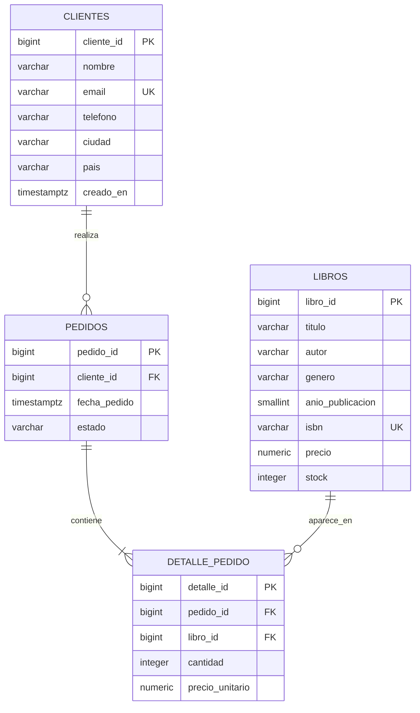

# Modelo entidad–relación: librería en línea

Este modelo normaliza la tabla `Orders` original: un pedido puede tener varios libros y cada línea conserva el precio que tenía el libro al momento de la compra.

## Cardinalidades

- Un cliente puede realizar cero o muchos pedidos; cada pedido pertenece a un único cliente.
- Un pedido contiene una o más líneas de detalle.
- Un libro puede no haberse vendido o aparecer en muchas líneas de detalle.
- `detalle_pedido` resuelve la relación muchos-a-muchos entre pedidos y libros.
